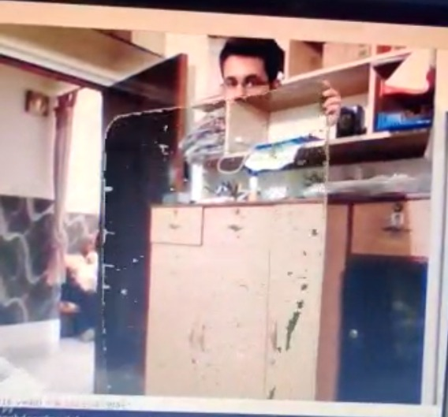

# Repository of Independent Projects, Courses and Competitions on Computer Vision

Courses
  - CS763: Computer Vision Spring 2020 course at IIT Bombay (Assignments and Lab Sessions)
  - Fundamentals of Image and Video Processing (NWU, Coursera)
  
Projects
  1. Invisibility Cloak
  Inspired by harry potter, the invisibility cloak one of the most popular image processing projects out there. Making use of colour thresholding mask on video frames and applying the background image data, the invisbility cloak effect can be recreated.
  
  
