# Repository of Independent Projects, Courses and Competitions on Computer Vision

Courses
  - CS763: Computer Vision Spring 2020 course at IIT Bombay (Assignments and Lab Sessions)
  - Fundamentals of Image and Video Processing (NWU, Coursera)
  
Projects (code can be found in "projects" folder)
     
   1. Social Distancing Detection - COVID19 Challenge
    
   Through background seperation and frame-to-frame difference, humans are detected using motion detection. The countour detected bounding boxes then provide enough information to detect violation of social distancing using thresholding techniques. 

    
   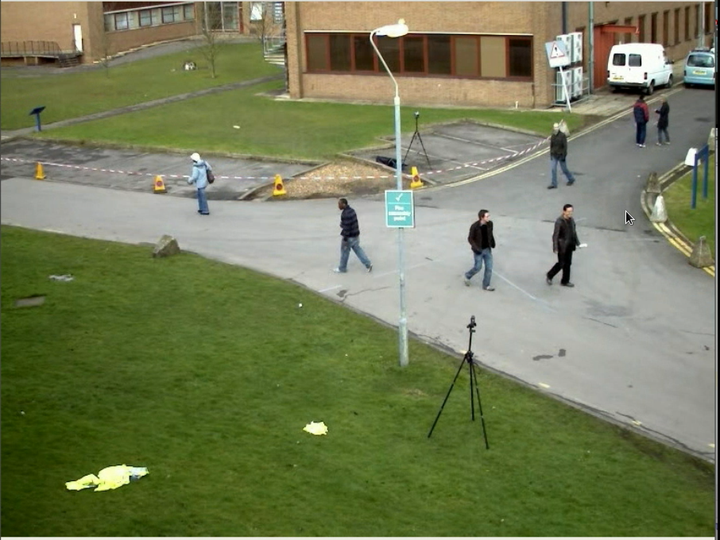
   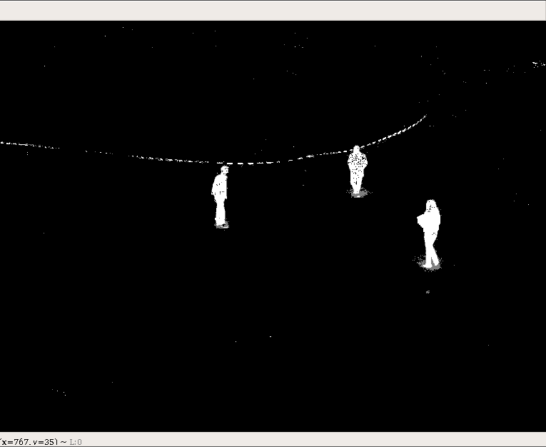
   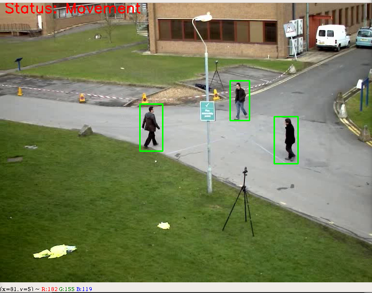
  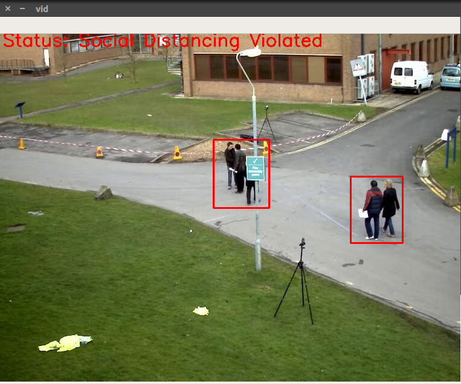
  
  
  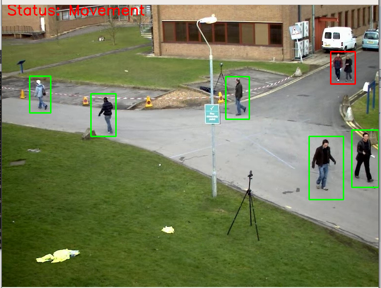

  2. Computer Vision based Pick and Place Robotic Manipulator Arm
      My work as a summer research intern at Bio-robotics Lab, Hanyang University, Seoul, South Korea. Detection, localization and pose estimation of object using Convolutional Neural Networks and depth cameras. Utilised the Faster-RCNN algorithm for object detection. Refer to this repository for details: [[Vision-Maniupulator](https://github.com/meghdeepj/vision-mani.git)]
 
    
   
  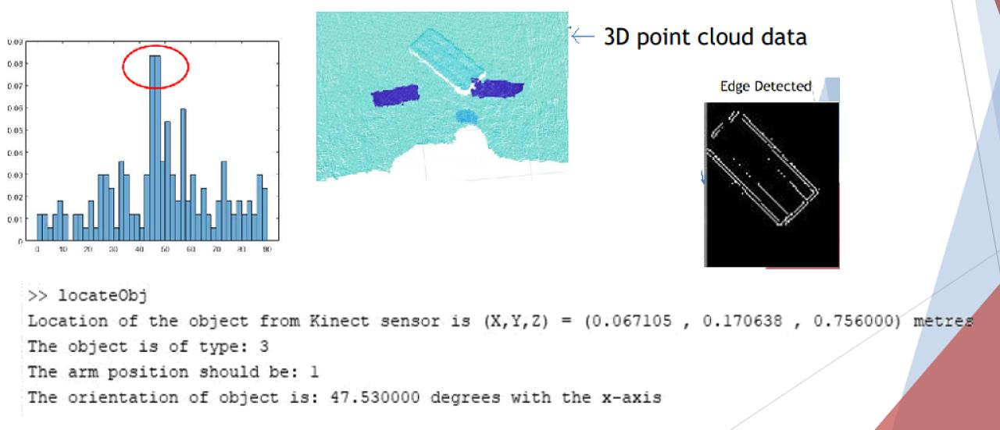
 
   

   3. Objection Detection Challenge
    
   Using transfer learning on Yolov3 Object detection model pre-trained on COCO dataset, drawing inferences from the results. Interesting observation: Shifting the grip on my mobile phone from vertical to pointing, changes the detection to "remote" thus proving that the model detects context and subtleties

    
   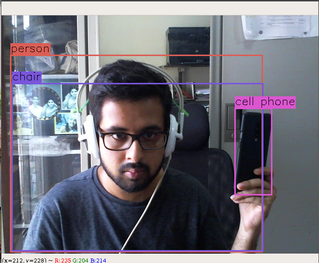
   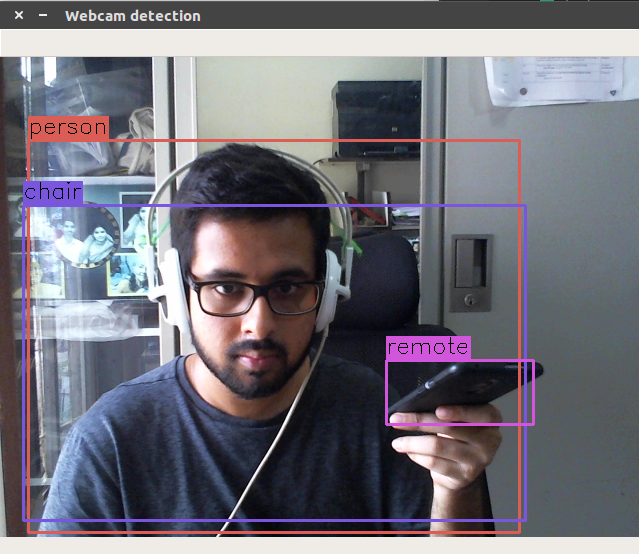
   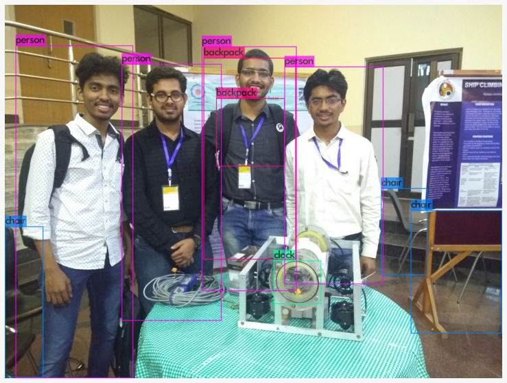
  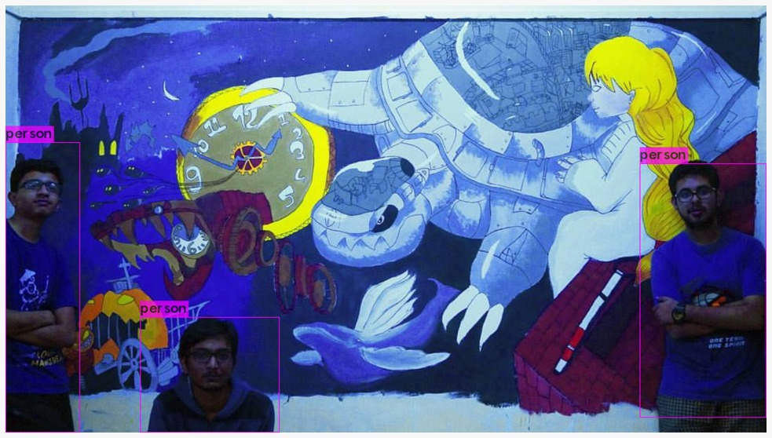

   4. Lane Detection for Self Driving Car
    
   Implemented using OpenCV, the lane detection algorithm makes use of canny edge detection with probabilistic Hough line transform to detect lanes for self driving cars. Thresholding and tuning is doen to ensure line transforms detect prominent lanes. The algorithm is robust to road curvatures and change in lighting conditions such as sunglight glare.

    
   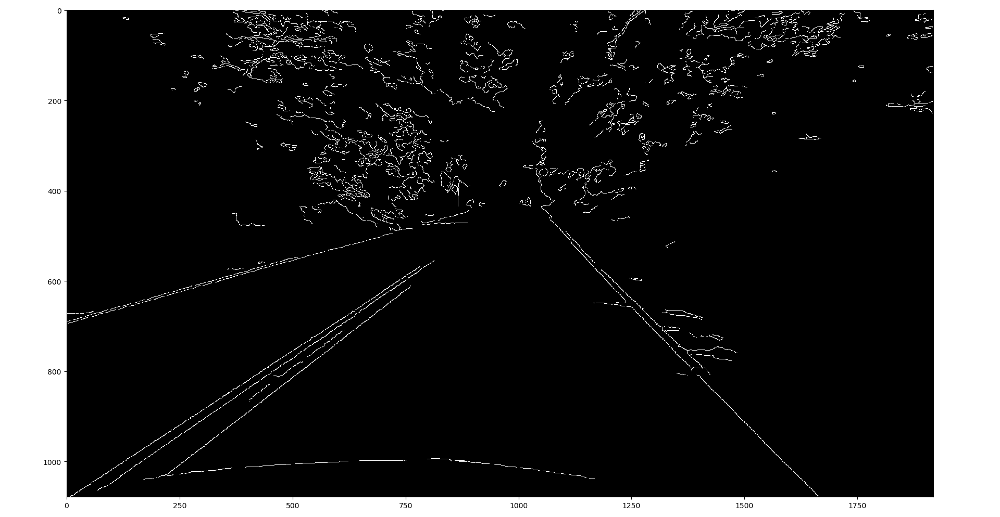
   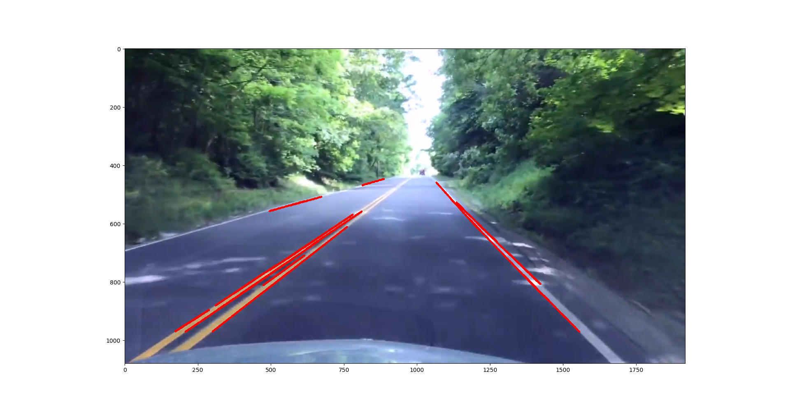
<!--    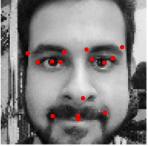 -->

  5. Facial Keypoint Detection Challenge
    
   Using Convolutional Neural Networks trained a facial keypoint detector that can locate 15 facial keypoints from a grayscale cropped image of a person. Robust enough to work on my face, even though it wasn't part of the similar distribution testset.

    
   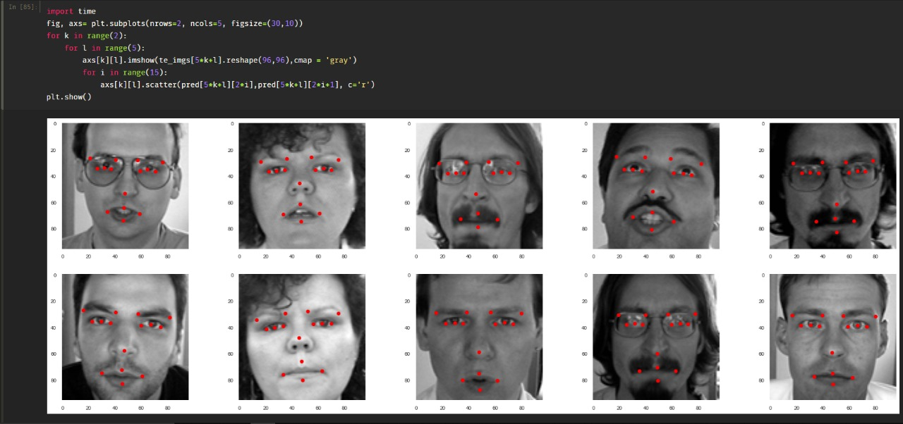
  

  6. Oreo detection and Counter Challenge
    
   Detection and counting oreos during production. Using OpenCV made use of colour thresholding and contour detection to count the number of oreos being produced that are completely contained in the video frame.

    
   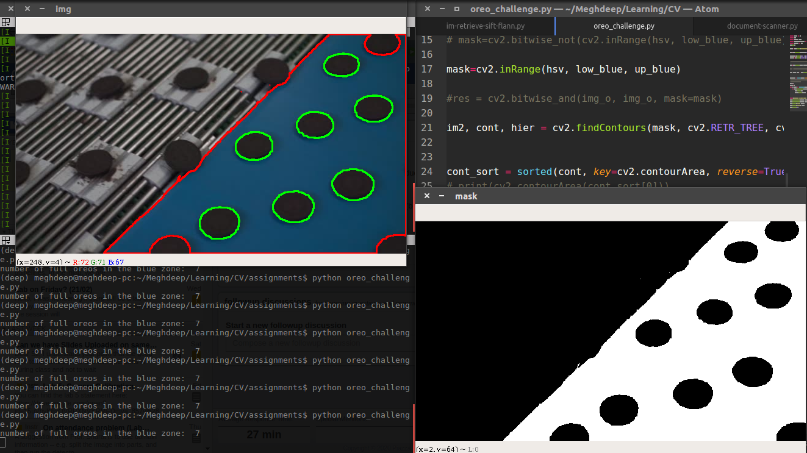

  7. Virtual Cam
  
   Visualising 2D objects from the perspective of a virtual camera that can move around in 3D space with 6degrees of freedom. Making use     of camera calibration and homography to reproject the 2D image to a virtual 3D space, even with distortions.
   Inspired by Kaustubh Sadekar's github repo:[[Virtual Cam](https://github.com/kaustubh-sadekar/VirtualCam.git)]

    
   
   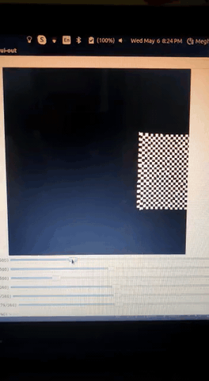

  8. Invisibility Cloak
  
  Inspired by harry potter, the invisibility cloak one of the most popular image processing projects out there. Using OpenCV made use of colour thresholding mask on video frames and applying the background image data, the invisbility cloak effect can be recreated.

    
   

