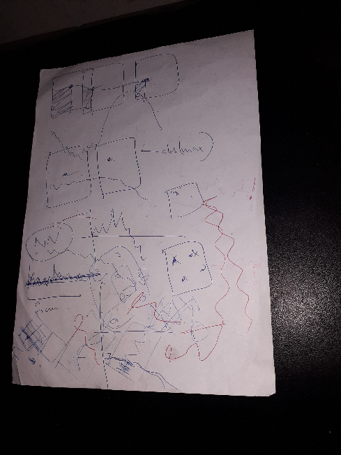
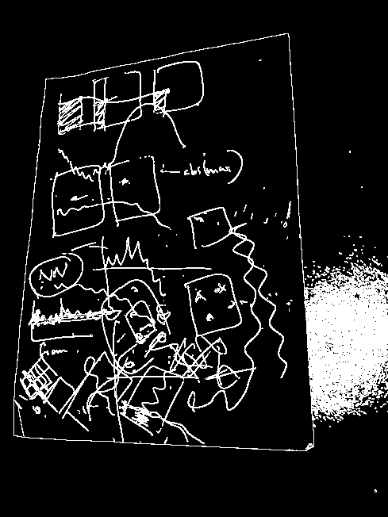
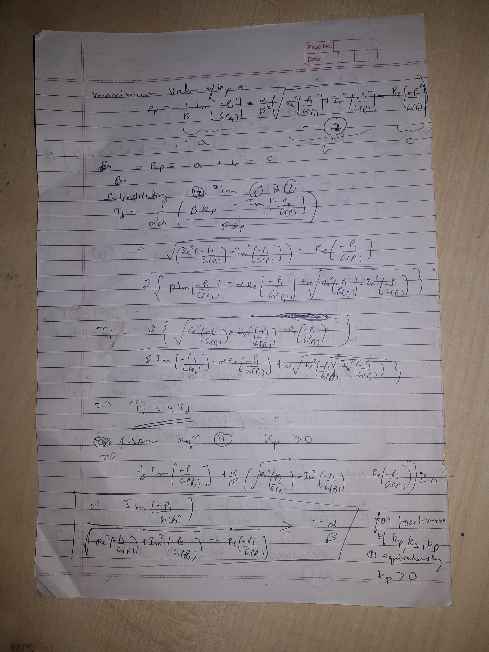
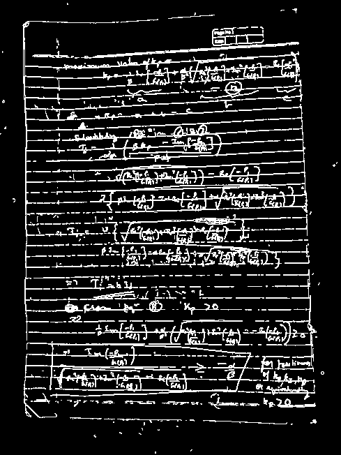

## Outlab code details
Two codes have been submitted. 
* `document-scanner.py` contains the main code
* `document-scanner-debug.py` contains some additional code to display images at different stages to aid the debugging process.

## Challenges yet to be resolved
1. Dificulty in proper contour detection in case of image glare when using the flash. Following images show the effect of glare and how it affects the contour detection process.

| |  |
|:---:|:---:|

2. Poor contrast of the document with respect to the background. Following image shows the effect of poor contrast in between background and document.

| |  |
|:---:|:---:|

